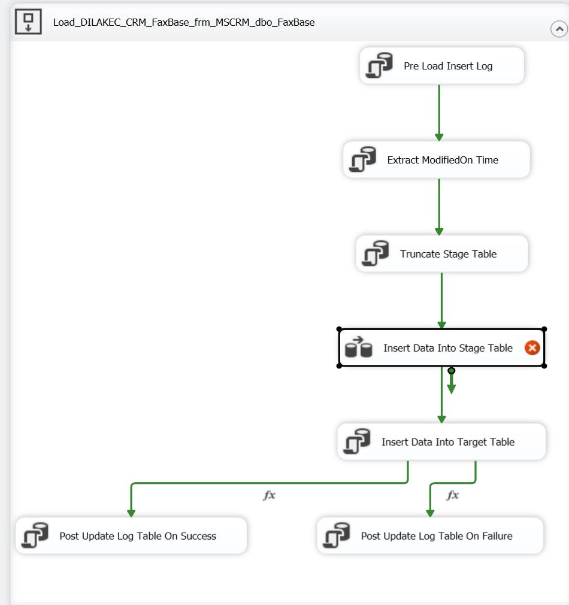
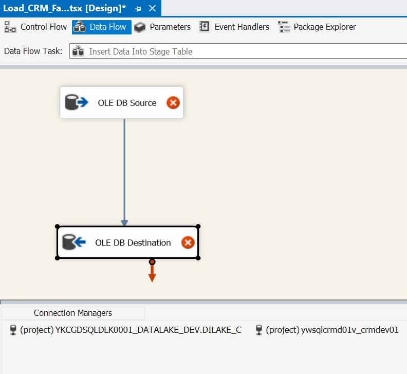
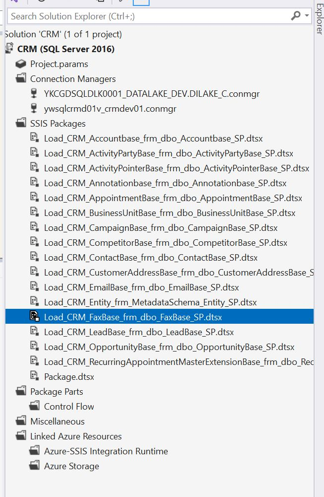

# Project Overview
This project showcases a complete Microsoft Business Intelligence (MSBI) workflow designed to analyze mental health data for Spokane Mental Health Services. The data is sourced from CSV files and a DB2 database, processed via ETL, stored in a data warehouse, and visualized using Power BI.

# Tools Used
SQL Server Management Studio (SSMS) - Data storage and query execution
SQL Server Integration Services (SSIS) - ETL: Extract, Transform, Load
SQL Server Analysis Services (SSAS) - Data modeling and analysis
Power BI - Reporting and dashboard creation

# Data Sources
CSV Files:
Mental illness prevalence
Burden of disease
Depression and anxiety coverage data
DB2 Database (additional clinical data)

# ETL Process
## Extract:
CSV files imported into SQL Server dbo schema using SSIS
DB2 data pulled using SSIS OLE DB Source
## Transform:
Data cleaned and transformed into staging tables (stage schema)
Dimension and Fact tables created for the data warehouse
## Load:
Final data loaded into the data warehouse for reporting

# Data Warehouse Design
## Dimension Tables:
dim_mental_illness
dim_country
dim_year
dim_demographics

## Fact Tables:
fact_prevalence
fact_burden
fact_treatment_gap

# SSIS Package Flow (Screenshots Attached)
Pre Load Log
Extract ModifiedOn Time
Truncate Stage Table
Insert into Stage Table (from OLE DB Source to Destination)
Load into Target Table
Post Load Log Update

# Power BI Sample Visuals
Global Prevalence Heat Map by Country and Year
Burden of Mental Illnesses (Line Chart)
Treatment Gap Analysis for Anxiety Disorders

## Conclusion
This project demonstrates the end-to-end MSBI process from data ingestion to insightful analytics. It highlights practical skills in SSIS, SSAS, SQL, and Power BI applied to real-world mental health data.
